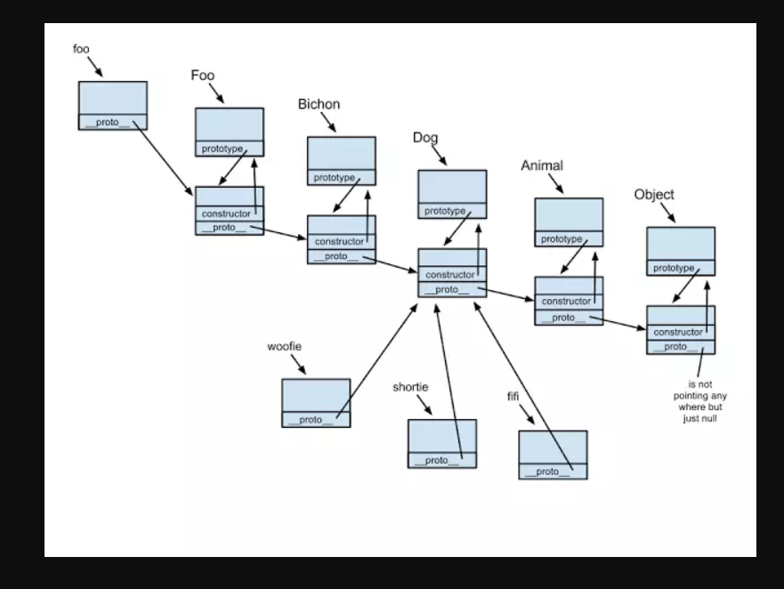
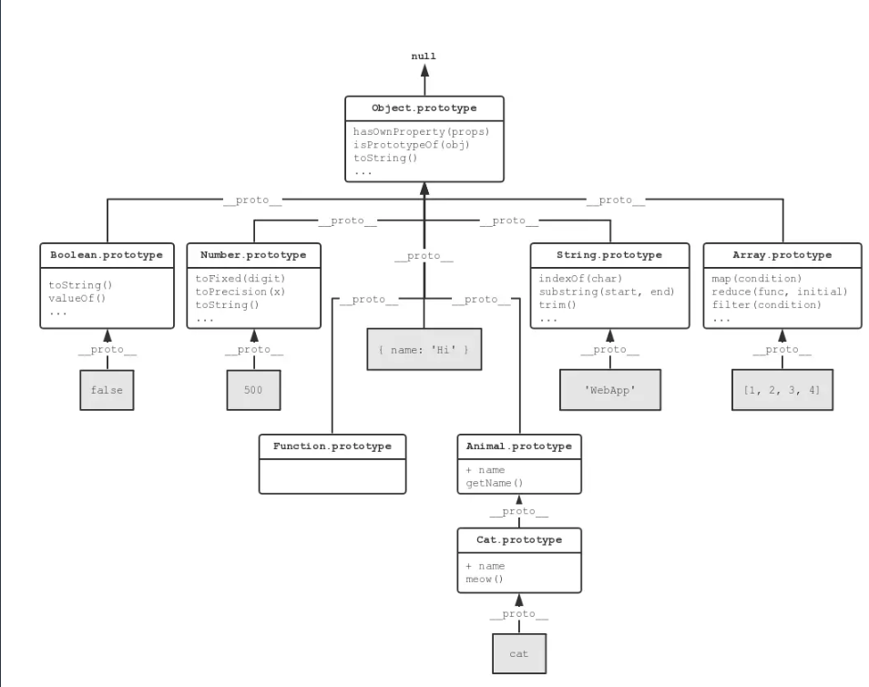
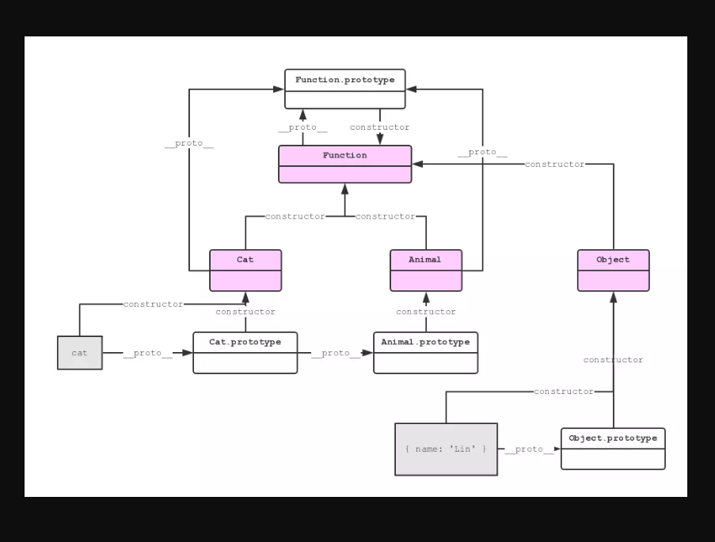

# 原型
所有的 JavaScript 对象都会从一个 prototype（原型对象）中继承属性和方法。

所有 JavaScript 中的对象都是位于原型链顶端的 Object 的实例。

JavaScript 对象有一个指向一个原型对象的链。当试图访问一个对象的属性时，它不仅仅在该对象上搜寻，还会搜寻该对象的原型，以及该对象的原型的原型，依次层层向上搜索，直到找到一个名字匹配的属性或到达原型链的末尾。

Date 对象, Array 对象, 以及 Person 对象从 Object.prototype 继承。



```js
function Cat(name){
    this.name=name;
}
// 给Cat的原型添加方法
Cat.prototype.sayhi=function(){
    console.log('hi');
}
// 存储原型的对象是_proto_
let one=new Cat('小白');
one.sayhi();
```
# 原型链
每个对象都拥有一个原型对象，通过 __proto__ 指针指向上一个原型 ，并从中继承方法和属性，同时原型对象也可能拥有原型，这样一层一层，逐级向上，最终指向 null（null 没有原型）。这种关系被称为原型链 (prototype chain)，通过原型链，一个对象会拥有定义在其他对象中的属性和方法。

# 关于原型和原型链的方法
Object.create()
>以现有模型作为新对象的_proto_,创建一个新的对象
```js
let cat = { type: '猫' };
let tiger=Object.create(cat);
tiger.type='老虎';
// {type='老虎'}
console.log(tiger);
```
Object.getOwnPropertyNames()
>获取一个对象的所有属性，并以数组格式返回
- 包括不可枚举属性
- 但不包括 Symbol 值作为名称的属性
- 不会获取到原型链上的属性
- 当不存在普通字符串作为名称的属性时返回一个空数组
```js
let cat={
    type:'布偶猫',
    name:'小白'
}
// ["type","name"]
console.log(Object.getOwnPropertyNames(cat));
```
Object.getPrototypeOf() / Object.setPrototypeOf()
>获取/设置一个对象的原型
```js
let cat = {
    type: '猫',
    sayhi(){
        console.log('hi');
    }
};
let dog={
    type:'狗'
}
let tiger = Object.create(cat);
// {type: "猫", sayhi: ƒ}
console.log(Object.getPrototypeOf(tiger));
/**
 * des:设置一个对象的原型对象
 * @param {tiger:object} 目标对象
 * @param {dog:prototype} 目标prototype
*/
Object.setPrototypeOf(tiger,dog);
// {type: "狗"}
console.log(Object.getPrototypeOf(tiger));
```
hasOwnProperty
>判断一个对象是否含有某个属性
```js
let cat={
    type:'布偶猫'
}
// true
console.log(cat.hasOwnProperty('type'));
```
isPrototypeOf
>检测一个对象是否存在于另一个对象的原型链上
```js
let cat = {
    type: '猫',
    sayhi(){
        console.log('hi');
    }
};
let tiger = Object.create(cat);
// true
console.log(cat.isPrototypeOf(tiger));
```

# 总结
>JavaScript 继承是类继承还是原型继承？不是使用了 new 关键字么，应该跟类有关系吧？
- 是完全的原型继承。尽管用了 new 关键字，但其实只是个语法糖，跟类没有关系。JavaScript 没有类。它与类继承完全不同，只是长得像。好比雷锋和雷峰塔的关系。

>prototype 是什么东西？用来干啥？
- prototype 是个对象，只有函数上有。它是用来存储对象的属性（数据和方法）的地方，是实现 JavaScript 原型继承的基础。

>__proto__ 是什么东西？用来干啥？
- __proto__ 是个指向 prototype 的引用。用以辅助原型继承中向上查找的实现。虽然它得到了所有浏览器的支持，但并不是规范所推荐的做法。严谨地说，它是一个指向 [[Prototype]] 的引用。

>constructor 是什么东西？用来干啥？
- 是对象上一个指向构造函数的引用。用来辅助 instanceof 等关键字的实现。



# 面试题
网上有一道美团外卖的面试题是这样的：
```js
Function.prototype.a = 'a';
Object.prototype.b = 'b';
function Person(){};
var p = new Person();
console.log('p.a: '+ p.a); // p.a: undefined
console.log('p.b: '+ p.b); // p.b: b  问为什么？
```
有不少同学第一眼看上去就觉得很疑惑，p不是应该继承了Function原型里面的属性吗，为什么p.a返回值是undefined呢？
其实，只要仔细想一想就很容易明白了，Person函数才是Function对象的一个实例，所以通过Person.a可以访问到Function
原型里面的属性，但是new Person()返回来的是一个对象，它是Object的一个实例,是没有继承Function的，所以无法访问
Function原型里面的属性。但是,由于在js里面所有对象都是Object的实例，所以，Person函数可以访问到Object原型里面的
属性，Person.b => 'b' 
